<a id="top"></a>

<p align="center">
  
  
  
  
  
  
  
</p>

<h1 id="centered-header" align="center">$${\color{green}PI \ Mobi}$$</h1>

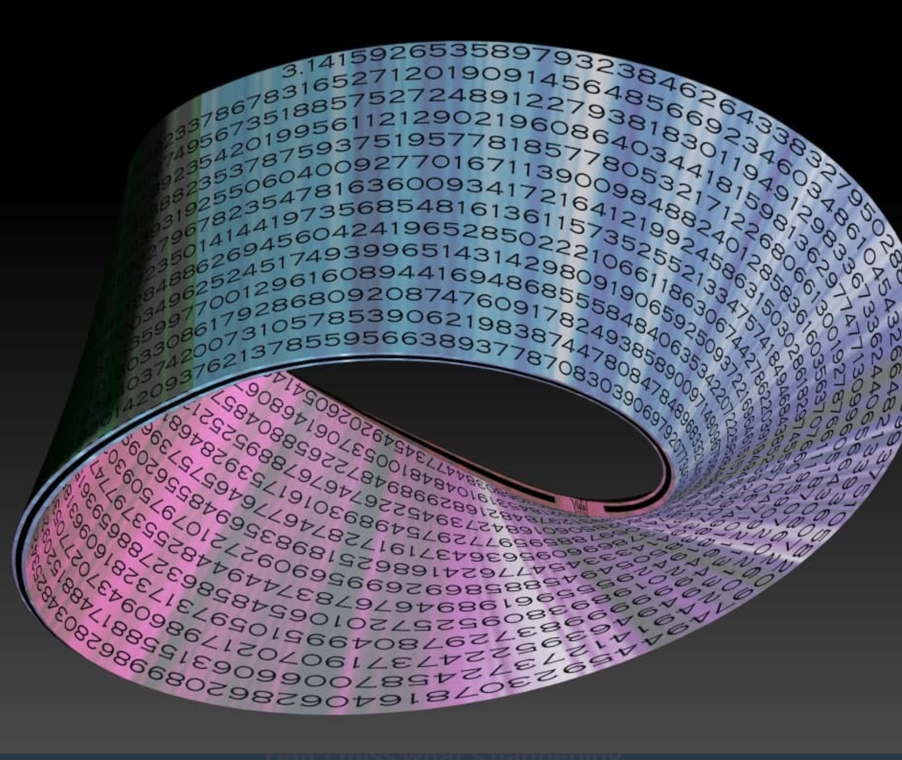

***
<h3 align="center">Description</h3>

***

**Pi Mobi** was the last puzzle that used **PGP** elements in it.

**Pi Mobi** was created before Z3301 aka richard todd miller's involvement with puzzle creation.

- (https://youtu.be/MNiW94XQhWM?si=-6rZbLKcSGPLcyuP)

- Are we paying attention yet? The main twitter on jan 05 2016 made this post. Pay attention to the time frame for proof of pi.mobi being 3301. (https://x.com/1231507051321/status/684596461628223488?s=19)
  - (https://infotomb.com/4gq25.jpg)
  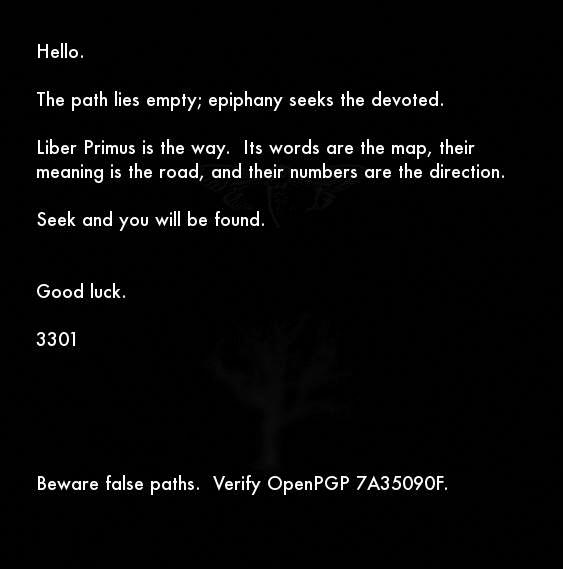
  - This was superimposed in the background.
  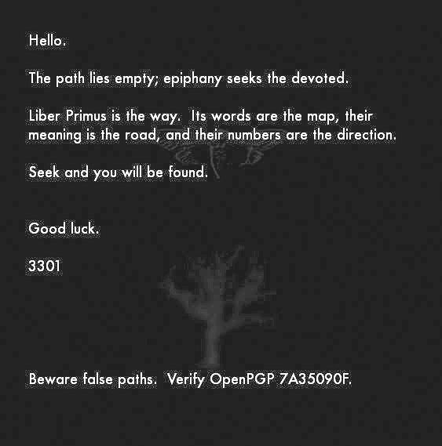

  - There was an outguess signed pgp message embedded into 4gq25.jpg. You can find the message in Solves under [`Solves`](https://github/BHQST/3301/Solves/4gq25.jpg_outguess.txt)

  - For the people that don't know how to install the old outguess, you can use (https://www.aperisolve.com) which seems to still work on old outguess files. the newer version of outguess will not work on outguess files made with older version.

- (http://31415926535897932384626433832795028841971693993751.mobi)

- (http://31415926535897932384626433832795028841971693993751.mobi:80/BM2cSwMJ7SaEji4qU8plisEkVHuHCHhmZgwh.html)

- (https://www.youtube.com/watch?v=20zQdkZKMy4&feature=youtu.be)

-  (http://31415926535897932384626433832795028841971693993751.mobi/3301.html)
   - **This message was encrypted with playfair cipher with key of tyranny. Still on the french theme.**
- Not sure if the Bit message part is still live anymore for all the **"BM-"** codes.

- (http://31415926535897932384626433832795028841971693993751.mobi/BM2cSwMJ7SaEji4qU8plisEkVHuHCHhmZgwh.html)
  - The BM code is also the same as 
  - Without :80 port there was **"322.png"** and page title was 322. Of a solver has this please upload to the github.
  - (https://youtu.be/p9msoJlE4xw?si=WoefTK80eSeFP16-)
  - There was also some text in the source.
    - ἔνδον τοῦ πύργου, οὗ ὁ ἄνεμος ἐπιβουλεύει σὺν τὰ *****τοῦ/τῆϛ***** Çelebi πτερὰ, κεῖται πλίνθος ἣ ἐνέπει μῦθον, εὖτε ἡ θεωρία διαμένει. Ζητοὺ καὶ εὑρίσκου.
      - It is Greek. "Inside the tower, where the wind whispers with the wings of Çelebi, lies a brick that embodies myth, or theory resides. Seek and you will find."

(http://zvsacxv5yiepemnt.onion/xmXZAO)

**Chêne chapelle ou Chêne d'Allouville**
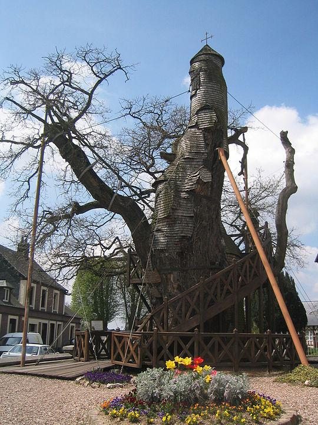

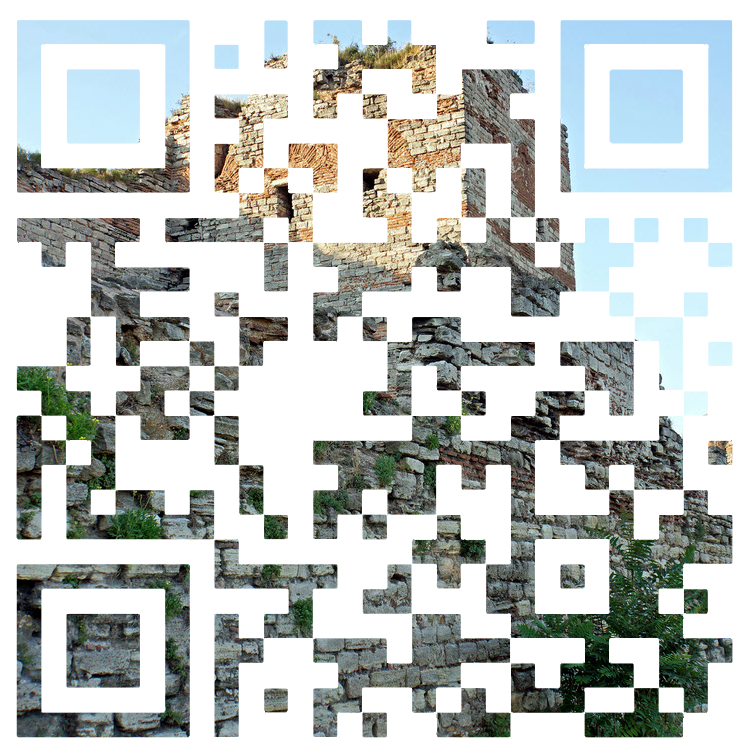

(https://www.youtube.com/watch?app=desktop&v=BVww3t5E60Q&t=42s)

***
<h4 align="center">Jan 5, 2016</h4>

***
- (https://youtu.be/BzA_Le3Iq_w?si=bnbQhQyxC6WlC4cl)

  - This was in the description. 
    > O sorry earth, when this bleak bitter sleep
Stirs and turns and time once more is green,
In empty path and lane and grass will creep
With none to tread it clean.
    > http://31415926535897932384626433832795028841971693993751.mobi
    >
    >
    >Seek and you will be found.
    >
    > Good luck
    >
    > 3301

  

- This was the start. Take notice of the user name. Also at the 33 second mark is a QR code.

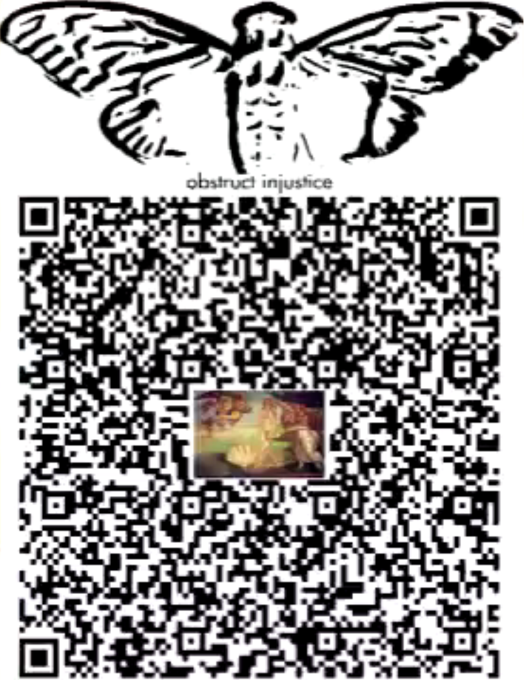

- The picture within the QR-Code is **"Birth of Venus"**.
  - This drawing is by the italian artist **"Sandro Botticelli"**.    
- The QR code was on screen for 3/10th's of a second.
  - See Circled in green below.


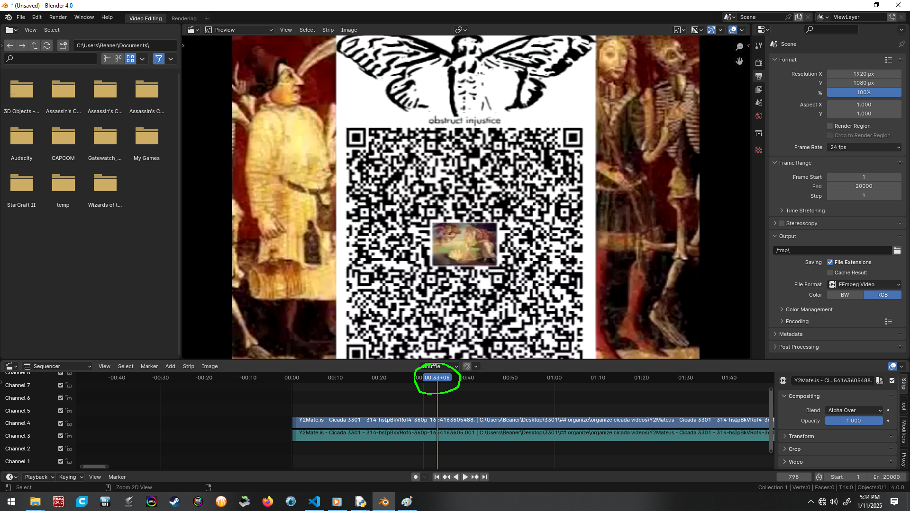

- The QR code scans to some text.
  - Gen 1:1 In the beginning God created the heaven and the earth. 
  - 31415926535897932384626433832795028841971693993751.MOBI 
  - BM-2cW5qm7K6R8xhoFXuK9ifNARQfeKNFTNQ9
  - BM-2cUYDhBNPTmrwTErf5DfqrnXPfQyCZwrM6
    - This was also on the picture Built from the hex code.
  - **EXTRACT YOURSELF FROM THE CONFINES OF YOUR COCOON, AND EMERGE, FALL AWAKE. OBSTRUCT INJUSTICE**

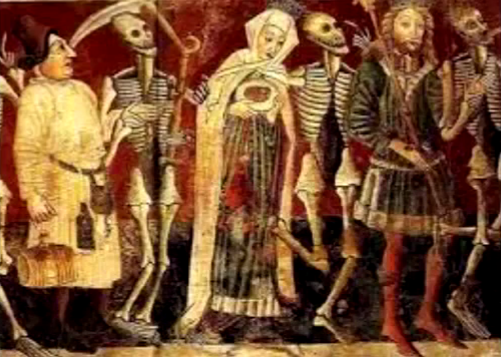
- The image below was in the background of video. 
It is on an entrance door in the interior of St. Mary's, there sits **"Dance of Death"** painted by Vincent de Kastav,1474. This was at the time of the **"French Revolution"**
- The music is by **"Michael Haydn"** brother of joseph. A play on words, hidden in plain site.
***
<h4 align="center">Jan 9, 2016</h4>


***
- BM-2cSp3oGoQjddTz1YgBiw3h59uNT3v1Hg33.png
  - This was hid in the source of the site.
 

<div align="center">

There's music in the sighing of a reed;
There's music in the gushing of a rill;
There's music in all things, if men had ears;
Their earth is but an echo of the spheres.
<u>***This is from*** "**Lord Bryon**" ***a poem***.</u>
</div>     

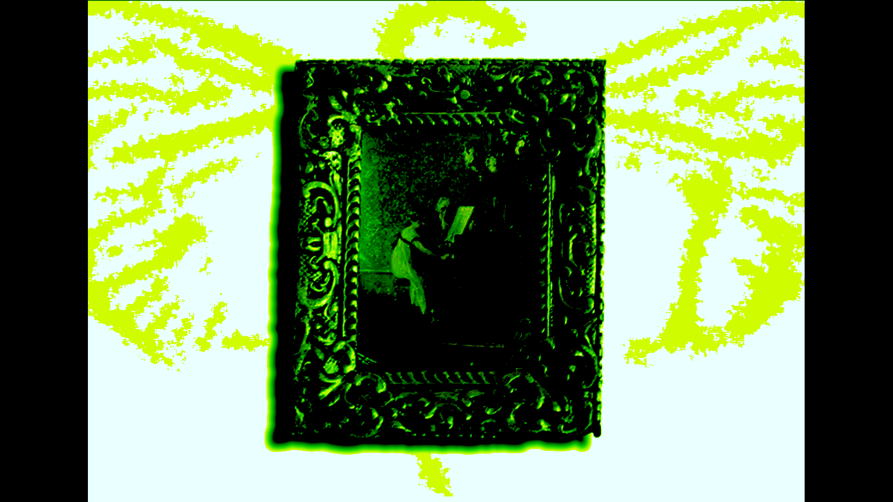

  - http://31415926535897932384626433832795028841971693993751.mobi/home.html
    - This displays a big chunk of hex code that reverts back to a .png. The hint was the title of the page LesTriosMages.png a refference to the 3 mages. The raw data can be found in [`Assets`](https://github/BHQST/3301/Assets/LesTriosMages.txt) for followers looking to learn a skill. You can also go directly to the image [`hex.png`](Solves/hex.png). 

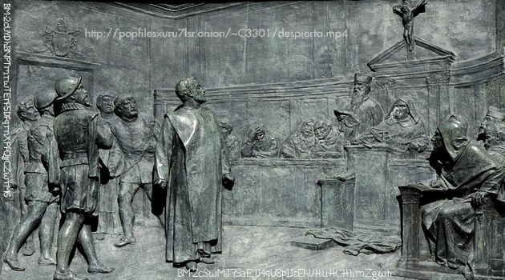
 
  - http://popfilesxuru7lsr.onion/~C3301/despierta.mp4
    - My archive copy is corrupted. If any solvers have this please contribute to this github.
  - BM-2cUYDhBNPTmrwTErf5DfqrnXPfQyCZwrM6
    - This also was in 314 on youtube. its in the QR-code.
  - BM-2cSwMJ7SaEji4qU8plisEkVHuHCHhmZgwh
    - Leads to this link. (http://31415926535897932384626433832795028841971693993751.mobi:80/BM2cSwMJ7SaEji4qU8plisEkVHuHCHhmZgwh.html)
***
<h4 align="center">Jun 26, 2016</h4>

***
 - The site changed and now displayed this ciphered message.
 - Hidden note within site source. **"Something ends, something begins. A date in history is the epoch of your journey. Eight numbers stand between you and the answers. Solve the test and you will be found."** There was also an onion link 	 (http://ln6vyadk4hv3dnyt.onion/i/1amhajich.png)
     - I no longer have the original. Will show the image and the what was involved with hiding meta-data in jpg form till another seeker or solver shares original file. The picture is **"Portraits des impatiaux, des moderes, des moderateures, autre fois dits les aristocrates. (1789) A french revolutionary illustration showing the two faces of the aristocracy."** In english it translates to portraits of the impartials, the moderates, the moderators formaly known as the aristocrates. 
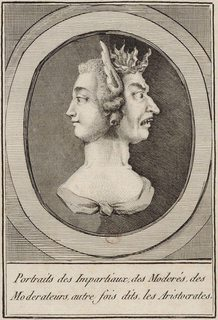

<div align="center">
Wlw hccnm pwdwv m ulzia kksgw as npneeij U gfpxg xrv lts wwwhv rj jqdidm ewwyjzsx
Mcg ervfuba oijfg lwmjs fxbf pi A dcmp bb tumfs as Azvffi zqoppv hlwijp qifvfwo
Lwmf gj kbmqwwx C Etvt sqh kqbx qwelk xzk Uyymesow lts wzuzsqh gr Vyldrf lw mbch eprw
Wlwz ri epbm fseyoho W Xaqk la gbfb hh wlae Omdmztoc az hbpqe xlrsx vixm
Yww xzk giwlvwuw hagmpaf lkmk ownj ws jhfwxg nsig lkvwmhyy bb tdxzq hbpqe xhil
Ub nsm odrsv at Hzjvdlxq ffuxxyaqk lts bpiel drv fvy smnv oil fvy Mifllpdq rygwhj
Wlwes lpjrdomggg mplvllsme gylt gzhq mb C Uywvfwiv ub ygmeddwluba npnaqw
</div>    

- <u>"Translates with vigenere cipher with key of **"DESMOULINS"** the vigenere cipher was french created. Follows a french theme."</u>
      
    - **Translation** "The voice ceasd a groan shook my chamber I slept for the cloud of repose returned But morning dawnd heavy upon me I rose to bring my Prince heaven utterd counselHear my counsel O King and send forth thy Generals the command of Heaven is upon thee Then do thou command O King to shut up this Assembly in their final home Let thy soldiers possess this city of rebels that threaten to bathe their feet In the blood of Nobility trampling the heart and the head let the Bastille devourThese rebellious seditious seal them up O Anointed in everlasting chains"
 
 - [`Encryption_Tools`](https://github/BHQST/Encryption_Tools) holds a python script for the tech people.
          - For the non tech people you can also use https://decode.fr/en

***
<h4 align="center">Jul 24, 2016</h4>

 ***
  - (http://31415926535897932384626433832795028841971693993751.mobi/3301)
	 title "seek"
    - The picture is in runes and also says SEEK like the title.
   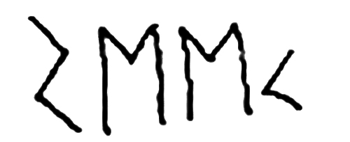

  - (http://31415926535897932384626433832795028841971693993751.mobi/test.txt) This was a test that you emailed the answers to the test to an email below.

1. You're a treasure hunter and, along with your 9 companions, you just discovered  a buried chest with 100 silver coins inside. Amongst your crew there is a strict hierarchy (with you being the most important one) and there are no two equally important  people. You and your companions decided that you are going to propose the  way of distributing the treasure using aforementioned hierarchy. When someone makes his proposal , all of the treasure hunters ( including the proposing one) are voting whether  to accept it or decline it. If at least half of the treasure hunters  vote  "for" , the proposal is accepted and the treasure distributed but if the majority votes "against", the one ,who made the proposal , is killed off and the next one in the hierarchy has the right to make a proposal. The voting order is the same as the proposing order. The goal of each and everyone of the treasure hunters ( you included)  is to gain the highest amount of silver coins possible and survive. Every treasure hunter is equally as smart as the rest and votes in a way allowing him to achieve that goal but if said treasure hunter was to gain 0 silver coins , then he always votes "against".   You , as the most important one , make the first proposal.
What way of distributing are you going to propose to achieve the goal?
Substantiate your answer.
 
2. Prove that  φ(n) = (ρ - 1) (q - 1)  when N = ρq  and  both ρ and q are primes.
 
3. Zlsf auvmf qry , qai?
 
4. A master proposes a game to a man. He says " I have two envelopes. White and black. The white envelope contains a key to a box with 1000 golden coins. The black envelope contains either a key to a box with 1 000 000 golden coins or it contains nothing.  You have two choices : you can either take the black envelope only or you can take both of them.
The black envelope was filled many years ago by a Divinity. The Divinity can see the future. The Divinity is never wrong.  The Divinity has done this :
- If it predicted that you would take the black envelope, it  put the key to the box with 1 000 000 coins into the black envelope
- If it predicted that you would take both envelopes , it put nothing into the black envelope
The Divinity can see the future. The Divinity is never wrong.
a)  what would be your choice? Is it a difficult one to make?
b)  what possible question does this game illustrate?
Substantiate your answers.
 
5. Gswe gifvq zdthqb cq vb wqxafm cd xewviff hi pfcwumwzqy tb? Rpspsub.
 
6. You are the only one who survived of a sunken ship. You managed to make a provisory raft and you are drifting alongside the island coast. You know that this particular island is inhabited by two tribes. The ones that call themselves "Owls" and the ones that call themselves "Crows". The Owls are a kind and peaceful tribe and they always tell the truth. The Crows , on the other hand , are deceptive ,  malevolent and always lie.  You seek shelter amid the Owls. When you see one of the tribesmen standing near the shore , you shout to him "Are you an Owl or a Crow?" . The tribesman answers the question but it's drown out by the sound of the waves and you are unable to hear the response.  Your raft is drifting farther down when you encounter the second tribesman. You ask him an identical question to which he replies "I am an Owl" , he then points his finger at the first tribesman that you passed and says "he said he was an Owl". You keep on drifting and you encounter the third tribesman. You ask him the same question to which he replies in a friendly manner "I am an Owl. They are Crows. They both are liars".
Given the information provided :
a) can you establish any man's afilliation?
b) can you establish each man's affiliation?
c) which one of the tribesmen would be your safest option?
Substantiate your answers.
 
7. Gixuby epr orvv "ffoep".
 
8. What is the smallest square that has the largest number of repeating consecutive numbers?
 
9.  "There is no thing that is truly objective" . Do you agree/disagree with this statement? Why?
 
10. If "freedom" was a currency , what would make one truly rich? Why?
 
11. Zlsf ri ambhoi kffcgm sgu exfsl nwzhoiluba eprau tsfv nz madlkzfshxmal?

**ANSWERS: send to (8digitdate)@protonmail.com**

- Take note how the encrypted messages are in prime locations.
- These are ecncrypted with a vigenere cipher.
  - Passphrase is the same as the first encrypted message above. **"DESMOULINS"**
3. Zlsf auvmf qry , qai?
  - What makes you, you? 
5. Gswe gifvq zdthqb cq vb wqxafm cd xewviff hi pfcwumwzqy tb? Rpspsub.
  - Does sound happen if no entity is present to experience it? Explain.
7. Gixuby epr orvv "ffoep".
  - Define the word "truth".
11. Zlsf ri ambhoi kffcgm sgu exfsl nwzhoiluba eprau tsfv nz madlkzfshxmal?
  - What do people strive for after completing their path to enlightenment?

<div align="center">

***"There is four primes, a lead up to the emails they sent out."*** 
</div>

 - Here is the content of the emails solvers recieved after sending in the asnwers to test.

Hello

Your test answers have been positively verified

http://ln6vyadk4hv3dnyt.onion/i/1aq2rkesm.jpg
(3301 x 3301 in size)
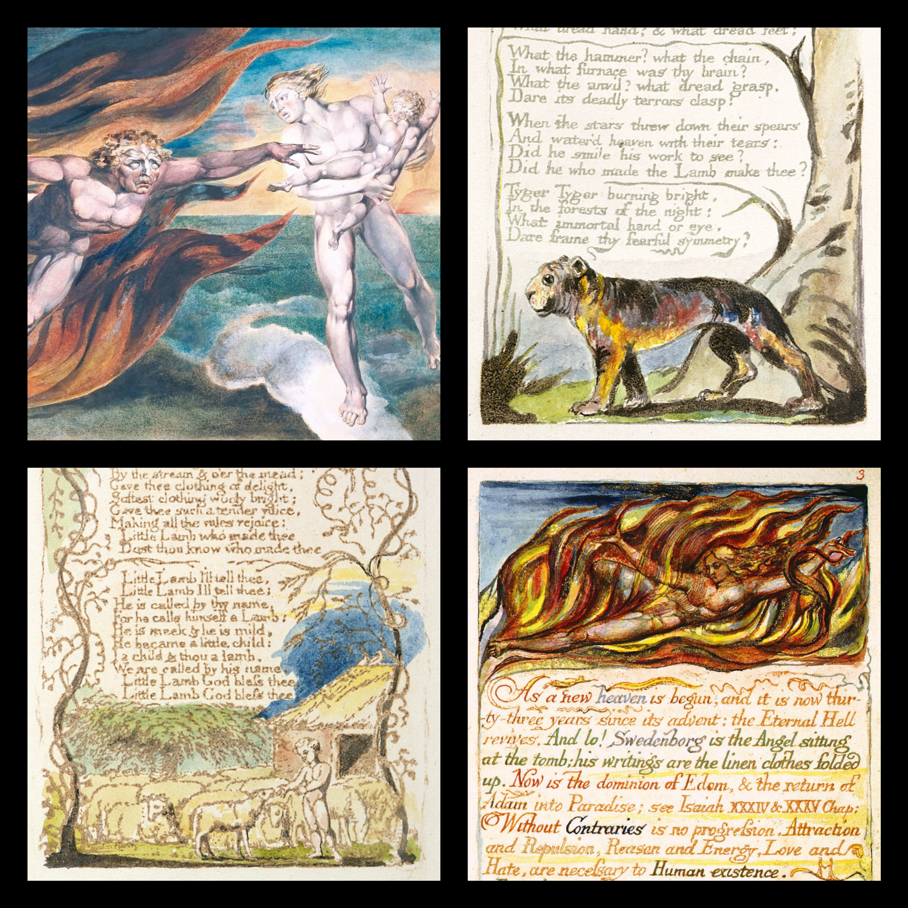

**All four works are of william blake. A hint back to cipher, think four sqaure. Also The email says the keys are right in front of you. "key's" not key.**

 - Top-Left: "The Good and Evil Angels"(1795)(Painting)
 - Top-Right: "The Tyger"(1794)(Poem)
 - Bottom-Left: “The Lamb”(1789)(Poem from "Songs of Innocence")
 - Bottom-Right: "Marriage of Heaven and Hell"(1790-1793)(Book) 


YLQ FRUS YILE ZRMK
OBQOY KSFRU ISMGME TAYFGZES SDCP KATMRFN
QDCS HTKDAYQ SETZEP KETRMV GM R GEKQETK QK DGHPMCLSOS MLR PSUY GYQD
DS TQNLG HFGU RLITX
QDE MOH CS TBCBT DG CTIKQ GD YLU
MEAR FNDTX TCW
RMNIRFRQ
QOYN YKR YLP ZNLH ER FLSKR

The keys are right in front of you
Good luck

***
<h3 align="center">Work List</h3>

***
- [ ] Gather assets from archive and prep to bring in to pi mobi branch
- [ ] Finish the markdown
- [ ] Locate the images from the dark web. Archive copys have been tampered with and are not original.
- [ ] Write up the history stand-point of this puzzle.
- [ ] Check if Bit Messege is still up.
***
<h3 align="center">Contribution</h3>

***
 - We welcome contributions to enhance the project!
 - Feel free to submit issues or pull requests to enhance the project.

1. **Fork the repository.**

2. **Clone the repository to your local machine:**
```bash
git clone https://github.com/BHQST/3301.git
cd 3301/PI_Mobi
```
3. **Create a new branch  for your future or fix:**
```bash
git checkout -b New_Addition
```
4. **Make your changes and commit them:**
```bash
git commit -m "Add new sauce"
```
5. **Push your changes to the new branch:**
```bash
git push origin New_Addition
```
6. **Open a pull request.**
 - Go to the repository on GitHub.
 - Compare your branch with the `main` branch and create a pull request.

***
<h3 align="center">Credits</h3>

***
- Credit to 3301 and the community of solvers and seekers alike.
- Will credit each individual that helps maintain this repo.
- Credit will also be giving to the solvers that have made things easier to put their work out there to make this all possible.
- If we miss Credit where credit is due please reach out by [Contact](#Contact)

***
<h3 align="center">License</h3>

***

- See the [LICENSE](LICENSE) file for details.

***
<h3 align="center">Contact</h3>

***

- For questions or feedback, contact Ghost Squad at theforgedesign@protonmail.com.

***
***
<p align="center">
  <a href="#top">Back To Top</a>
</p>
