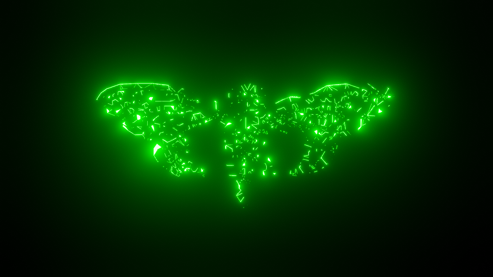

<a id="top"></a>

<p align="center">
  
  
  
  
  
  
  
</p>

<h1 id="centered-header" align="center">$${\color{green}**3301**}$$</h1> 



> [!NOTE]  
> Seek And Be Found!

> [!WARNING]
> It is on the inside!

> [!CAUTION]
> Protect your DNA

***
***

<h1 align="center">Table of Contents</h1>

<div align="center">
  <details>
    <summary>Click to Expand</summary>
    <div style="text-align: center;">
      &#8226; <a href="#Description">Description</a><br>
      &#8226; <a href="#Community">Community</a><br>
      &#8226; <a href="#Work List">Work List</a><br>
      &#8226; <a href="#Contribution">Contribution</a><br>
      &#8226; <a href="#Credits">Credits</a><br>
      &#8226; <a href="#License">License</a><br>
      &#8226; <a href="#Contact">Contact</a>
    </div>
  </details>
</div>


***
***

<h1 align="center">Description</h1>

- This project will hold many solves that solvers have either over looked or missed. This will be a community based project. We welcome any additions we may have missed or overlooked ourselves. Sometimes you have to look to the beginning to see the end. ♾️ 

<div align="center">
  <details>
    <summary>List Of Puzzles</summary>
    <div>
      <p><a href="https://github.com/BHQST/3301/tree/main/BBC">BBC</a></p>
      <p><a href="https://github.com/BHQST/3301/tree/main/PI_Mobi">Pi_Mobi</a>
      <p><a 
href="https://github.com/BHQST/3301/tree/main/Crypto_Puzzle">Crypto_Puzzle</a>   
      <p><a 
href="https://github.com/BHQST/3301/tree/main/Sevens_Exposed">Sevens_Exposed</a>
</p>
    </div>
  </details>
</div>

***
***

<h1 align="center">Community</h1>

- There is a community board set up for users to discuss the ongoing project of Cicada puzzles.
- Have ideas or questions? [Join the Discussion](https://github.com/BHQST/3301/discussions) to connect with others and share your thoughts!

***
***

<h1 align="center">Work List</h1>

  - [x] Port cicada stuff into here from Q project.
  - [x] Get the table of contents together.
  - [ ] Clean up Description.
  - [ ] Import LP notes.
  - [ ] Import newer puzzles people have missed chasing pgp.
  - [ ] Each puzzle will have python scripts to help solvers, will need to gather the resources and and link from tools. 

***
***

<h1 align="center">Contribution</h1>

 - We welcome contributions to enhance the project!
 - Feel free to submit issues or pull requests to enhance the project.

1. **Fork the repository.**

2. **Clone the repository to your local machine:**
```bash
git clone https://github.com/BHQST/3301.git
cd 3301
```
3. **Create a new branch  for your future or fix:**
```bash
git checkout -b New_Addition
```
4. **Make your changes and commit them:**
```bash
git commit -m "Add new sauce"
```
5. **Push your changes to the new branch:**
```bash
git push origin New_Addition
```
6. **Open a pull request.**
 - Go to the repository on GitHub.
 - Compare your branch with the `main` branch and create a pull request.

***
***

<h1 align="center">Credits</h1>

- Credit to 3301 and the community of solvers and seekers alike.
- Will credit each individual that helps maintain this repo.
- Credit will also be giving to the solvers that have made things easier to put their work out there to make this all possible.
- If we miss Credit where credit is due please reach out by [Contact](#Contact) or [Join the Discussion](https://github.com/BHQST/3301/discussions)

***
***

<h1 align="center">License</h1>

- See the [LICENSE](LICENSE) file for details.

***
***

<h1 align="center">Contact</h1>

- For questions or feedback, contact Ghost Squad at theforgedesign@protonmail.com.

<p align="center">
  <a href="#top">Back To Top</a>
</p>
