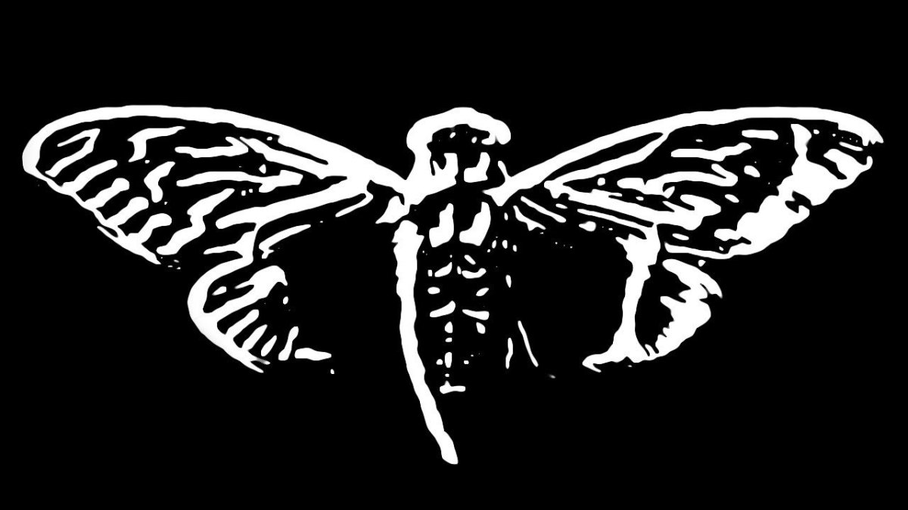

<p align="center">
 <a

  


 </a>
</p>

<h1 id="centered-header" align="center">$${\color{green}3301}$$</h1>



> [!NOTE]  
> Seek And Be Found!

> [!NOTE]
> https://theghostsofcicada.wordpress.com/2022/06/09/mozart-dracula/

> [!WARNING]
> It is on the inside!

> [!CAUTION]
> Protect your DNA


<h1 align="center">Table Of Content</h1>
<p align="center">
  <a href="#Description">Description</a> •
  <a href="#To Do">To Do</a> • 
 <a
 href="#Contribution">Contribution</a> •
  <a href="#License">License</a> •
  <a href="#Contact">Contact</a> 
</p>

***

<h1 align="center">Description</h1>
   - All things cicada

***

<h1 align="center">To Do</h1>
  - [ ] Port cicada stuff into here from Q project.
  - [ ] Get the table of contents together.
  - [ ] Clean up Description 

***

<h1 align="center">Contribution</h1>
  - Feel free to submit issues or pull requests to enhance the project.

1. Fork the repository.
2. Clone the repository to your local machine:
```bash
git clone https://github.com/BHQST/3301.git
cd 3301
```
3. Create a new branch (git checkout -b feature-branch).
4. Commit your changes (git commit -m "Add a new feature").
5. Push to the branch (git push origin feature-branch).
6. Open a pull request.

***

<h1 align="center">License</h1>

- See the [LICENSE](LICENSE) file for details.

***

<h1 align="center">Contact</h1>
• For questions or feedback, contact Ghost Squad at theforgedesign@protonmail.com
