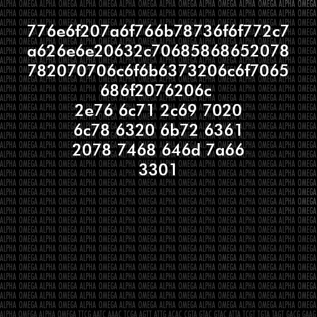

<a id="top"></a>

<h1 id="centered-header" align="center">$${\color{green}Sevens \ Exposed}$$</h1>


> [!WARNING]
> It is on the inside!
> [!CAUTION]
> Protect your DNA

***
<h2 align="center">Table of Contents</h2>

- Will work on this more in the coming days

***

<h2 align="center">Description</h2>
 
 - This branch will hold all of the sevens exposed puzzle assets and solves.
- http://sevens.exposed
- http://www.1711141131131.xyz

***
- **april 16,2017**
    - bay of pigs.png
    - bruno.mp3
    - 3142017final.mp3
    - finaldogsofwar.mp3
***
- **april 20,2017**
    - guilty.jpg
***
- **may 2,2017**
    - 703.jpg
    - 307.jpg
    - 037.jpg
    - star.mp3
    - Q.mp3
***
- **june 2,2017** 
    - TGIF
    - welcome back, bruno
    - 062817.jpg
    - ADCG.jpg
    - 62and17.gif
    - Deepstep.mp3
***
- **june 14,2017**
    "Ana and graham of the two and five
    ana and graham are the will to survive
    ana and graham will run down the kills
    ana and graham live in the hard drives
    as they approach the end of the cliff,
    they take a bow and leap from the edge
    only the sky, by the moon is lit,
    will bear witness to their final pledge.
    ana and graham by there tangled web,
    entwined by the lives that their souls hath need. 
    the spiders come out and weave up the dead,
    god can look down and mourn while he weeps.
    ana and graham and all they opposed,
    shall fall silent as they decompose
    the cicadas will sing as so it is composed
    and the cicadas shall ensure the sevens exopsed."
***
- **june 19,2017**
    "ana and graham expose the sevens and opposed the heavens
    ana and graham revealed the omega and concealed the stego
    ana and graham knew their demise before the apprise
    ana and graham told the cicada to reveal the sevens without
    asking questions.
    because when the devil curses our revel
    then sevens split, as luck would have it\
    - **34^5'50.59 N  118^6'22.68W  gps chords**
    - lacrimosa.mp3
***
- **june 28,2017**
    "website changed up and theres a message for ana
    ana there will come a time when you will decide between
    yourself and you loved ones. when it comes,  walk the path your
    peers would not, triumph in the victory you feel in your
    heart. a cab cede ether summer fruit. a bash steg mr hammer
    prate. weighted jetport moth."
    - Kees.mp3 
***
- **june 29,2017**
    - Elsa ~ 628

***
***

<h2 align="center">Work List</h2>

- [ ] Gather assets from archive and prep to bring in to Sevens Exposed branch.
- [ ] Port the notes into README.md

***
***

<h2 align="center">Contribution</h2>

 - We welcome contributions to enhance the project!
 - Feel free to submit issues or pull requests to enhance the project.

1. **Fork the repository.**

2. **Clone the repository to your local machine:**
```bash
git clone https://github.com/BHQST/3301.git
cd 3301/Sevens_Exposed
```
3. **Create a new branch  for your future or fix:**
```bash
git checkout -b New_Addition
```
4. **Make your changes and commit them:**
```bash
git commit -m "Add new sauce"
```
5. **Push your changes to the new branch:**
```bash
git push origin New_Addition
```
6. **Open a pull request.**
 - Go to the repository on GitHub.
 - Compare your branch with the `main` branch and create a pull request.

***
***

<h2 align="center">Credits</h2>

- Credit to 3301 and the community of solvers and seekers alike.
- Will credit each individual that helps maintain this repo.
- Credit will also be giving to the solvers that have made things easier to put their work out there to make this all possible.
- If we miss Credit where credit is due please reach out by [Contact](#Contact)

***
***

<h2 align="center">License</h2>

- See the [LICENSE](LICENSE) file for details.

***
***

<h2 align="center">Contact</h2>

- For questions or feedback, contact Ghost Squad at theforgedesign@protonmail.com.


<p align="center">
  <a href="#top">Back To Top</a>
</p>